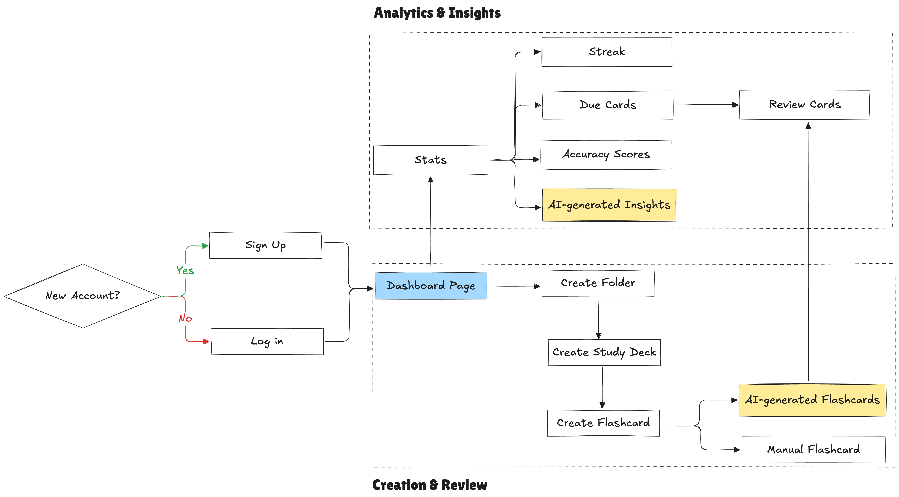
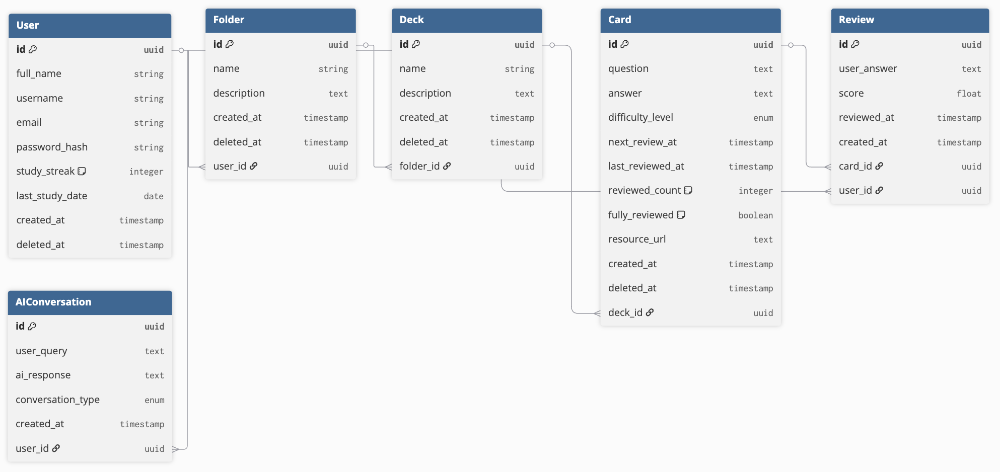

# Memora - AI-powered Flashcard App
During this summer, I have to prepare for technical interviews. There are many new and old concepts that I have to learn. So I want a space to help me perform deliberate practice and record my thought processes along the way. Memora is a flashcard app that helps you create, organize, and analyze your study decks and cards as well as keep track of your progress.

# Table of Content
1. [Key Features](#key-features)
2. [User Flow](#user-flow)
3. [Backend (Flask-Python)](#backend)
   - [Database Design](#database-design)
   - [RESTful APIs](#restful-apis)
4. [Frontend (React-JavaScript)](#frontend)
   - [Design](#design)
   - [Components](#components)

# Key Features
1. CRUD operations for folders, study decks and flashcards
2. Analytics-related operations to compute aggregate metrics like average accuracy score or improvement over time
3. AI-supported card and insights generation.

# User Flow
1. The user accesses the web app and creates a new account if they are a new user or signs in if they are an existing user
2. After successful authentication, user is redirected to the dashboard page where all the folders are displayed
3. In the **Dashboard page**, user can do 3 things:
    - Create a new folder with name and detailed description
    - Choose a folder to learn and be directed to the folder page
    - Navigate to other sections, namely Analytics, Profile, or Review Cards to see all the cards that have not yet been fully reviewed
4. In the **Folder page**, user can create a new study deck with a subtopic.
5. In the **Study Deck page**, user can do 2 things:
    - Create a new flashcard manually with question, answer and resource
    - Generate AI flashcard by uploading a PDF or source of truth
6. For each **Card**, the user can choose to review the card by typing the answer and get the accuracy score
7. Inside the **Analytics page**, the user can see their study streak, the number of cards due in 1 day, 7 days or 21 days, and the accuracy trends by folder:
8. User can use AI to analyze the learning patterns and progress to suggest a better study plan or roadmap to enhance the knowledge for that topic.

   
# Backend
## Database Design

## Services
The service layer defines how we interact with the database and is where complex business logic is implemented such as calculating the spaced repetition intervals or defining how to generate cards using AI. There are 5 core services I decided to include in the app:
| Service| Explanation |
|----------|----------|
| `auth_service`    |  Use JSON Web Token (JWT) as the method for authentication. When a user registers or logs in, an access token is created that allows the user to access protected resources. The user is logged out using a Redis blocklist to revoke their token. | 
| `crud_service`    | Basic creation, read, update, and deletion logic for folders, decks, and cards.   | 
| `review_service`    | The review logic uses `sentence_transformers` to check for semantic similarity between user's answer and the correct answer. It also implements the spaced repetition logic - each card must be reviewed at least 3 times to be considered fully reviewed and the intervals are 1, 7, and 21. After a card is reviewed, the app will calculate when should it be reviewed next until it reaches the required number of reviews|
| `analytics_service`    | The analytics logic allows user to keep track of their learning progress by showing the accuracy rate over time by study decks and the number of cards fully reviewed  |
| `ai_service`    | The AI service allows user to ask questions about their learning data and generate cards based on some text and PDF documents.  |

## RESTful APIs
### Authentication (`url_prefix=/auth`)
| Route| Method | Explanation |
|----------|----------|----------|
| `/register`    |  `POST`    | Create a new user     |
| `/login`    | `POST`  | Retrieve an existing user     |
| `/logout`    | `DELETE`  | Logs out an existing user     |

### Folders/Decks/Cards (`url_prefix=/folder, /deck, /card`)
| Route| Method | Explanation |
|----------|----------|----------|
| `/`    | `POST`     | Create a new folder|
| `/`    | `GET`  | Retrieve an existing folder     |
| `/<int:folder_id>`    | `PATCH`     | Update a folder's name and/or description |
| `/<int:folder_id>`    | `DELETE`  | Delete a folder     |
| `/<int:folder_id>`    | `POST`     | Create a new deck inside a specific folder|
| `/<int:deck_id>`    | `GET`  | Retrieve an existing study deck     |
| `/<int:deck_id>`    | `PATCH`     | Update a deck's name and/or description |
| `/<int:deck_id>`    | `DELETE`  | Delete an existing deck    |
| `/<int:deck_id>`    | `POST`     | Create a new card inside a specific deck|
| `/<int:card_id>`    | `GET`  | Retrieve an existing card     |
| `/<int:card_id>`    | `PATCH`  | Update an existing card     |
| `/<int:card_id>`    | `DELETE`  | Delete an existing card    |

### Analytics (`url_prefix=/analytics`)
| Route| Method | Explanation |
|----------|----------|----------|
| `/general`    | `GET`     | Retrieve general stats: total folders, decks, reviews, and study streak|
| `/folder/<int:folder_id>`    | `GET`  | Retrieve stats for a folder: accuracy for all decks |
| `/deck/<int:deck_id>`    | `GET`  | Retrieve stats for a deck:  accuracy for a deck |
| `/progress`    | `GET`  | Show user's progress within a time frame    |

### AI Routes
| Route| Method | Explanation |
|----------|----------|----------|
| Row 1    | Data     | More     |
| Row 2    | Content  | Here     |
# Frontend
## Design
https://www.figma.com/design/yTwM5Jfw4pBaNHggZQgIc6/Flashcards-Web-App?node-id=1-2&t=zc23a2Gq7XREdfmF-1
## Components

## Key Takeaways
- Standardizing the format and structure of the backend response (success, failure, duplicated, etc.) is tremendously helpful for integrating with the frontend, especially when rendering the data like lists. I encountered several bugs when fetching the data from the backend to the frontend because the structure of the response message is either nested or inconsistent.
## Next Steps
